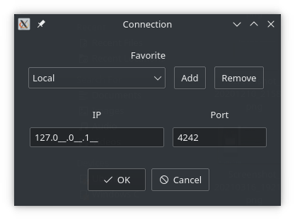
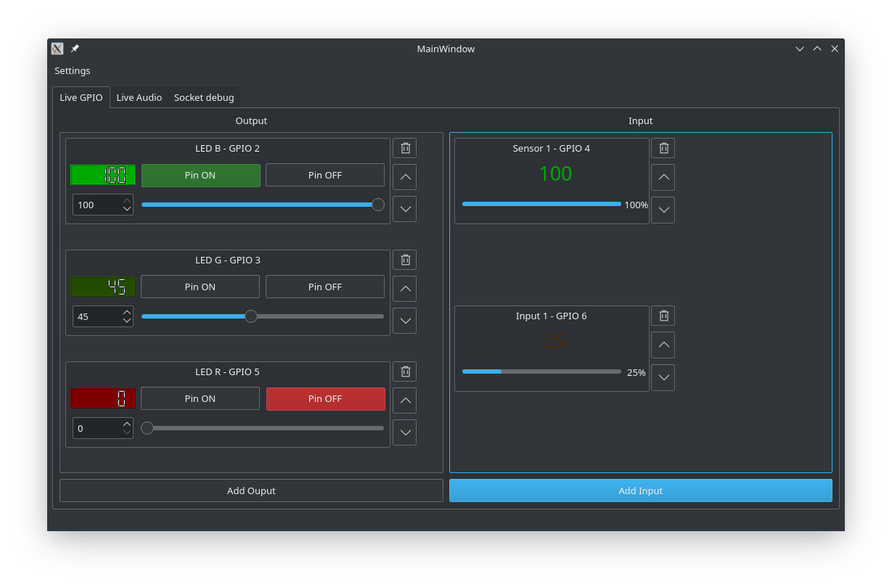
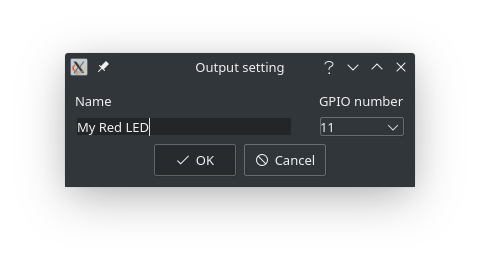

# Simple Rpi Gui
A simple remote gui to control Raspberry Pi's pins, written in C++.
  
it's composed of a **Server** (Raspberry only) and a **Client** (Linux and Windows) based on Qt.

*Disclamer: This project is not final and might have bugs, issues and incompletes features.*

## Build / Install
See here: [Build instruction](./doc/BUILD.md).

## How to use

### Step 1: Starting
1. **Build server and client (See [Build instruction](./doc/BUILD.md))**
2. **Generate cert & key (See [Build instruction](./doc/BUILD.md))**
3. **Copy mycert.pem and key.pem in client and server location**
4. **Start the server** on your raspberry 
5. **Start the client**

### Step 2: Connection

- **Enter the IP and Port of your server and click "OK"**
- **For now, The port is always 4242**
- Before connecting, you can add the current IP / Port as Favorite

### Step 3: Adding Output & Input

- **You can click "Add Output" or "Add input" to add and setup a pin as output or input**

- **You can select the GPIO pin number that will be used as output (set a value to the pin) or as input (reading a value from a pin)**
- You can set a custom name for this output / input.
  

**Now that we have our output and input created, we can now see the value readed in real time for inputs**  

**We can now change the value in real time for outputs:**
- **Clicking "Pin ON":** Will set the pin value to 1 or 100%.
- **Clicking "Pin OFF":** Will set the pin value to 0 or 0%.
- **Sliding the bar:** change from 0% to 100%. *This make use of the PWM (Pulse-Width Modulation) feature in a Raspberry Pi*.
  
*Every action is directly applied to the raspberry Pi via the server*

**Other interaction:**
- You can **change the name and the GPIO pin** used by double clicking on the title of an output / input. *(ex: double clicking on "LED B - GPIO 2" showed in the picture above)*.
- You can **move up and down any output or input** by using the arrows on the right of each one to help you organize as you wish.
- You can **delete an output or input** by clicking on the trash icon in the top right of each output / input. For outputs, it will always set the input value to 0 before deleting.

